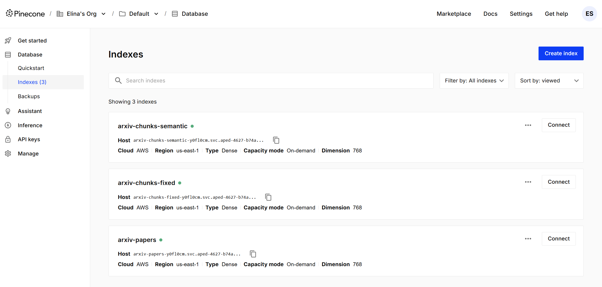
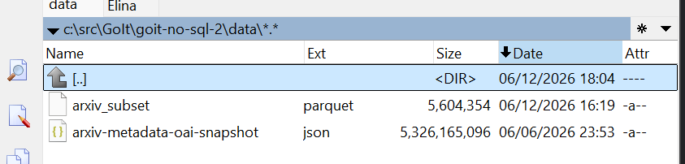
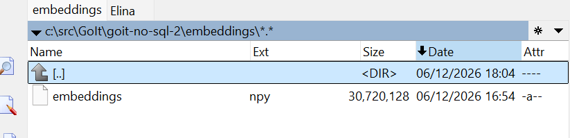
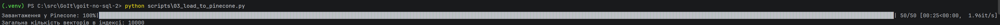

# goit-no-sql-2

## Зміст

- [1.2. Вибір інструментів](#12-вибір-інструментів)
  - [1.2.1. Pinecone vs Qdrant vs Chroma: розгортання, ліцензія, продуктивність і сценарії вибору](#121-pinecone-vs-qdrant-vs-chroma-розгортання-ліцензія-продуктивність-і-сценарії-вибору)
  - [1.2.2. Чому для задачі пошуку по науковим текстам обрана модель `specter2_base`, а не `all-MiniLM-L6-v2`?](#122-чому-для-задачі-пошуку-по-науковим-текстам-обрана-модель-specter2_base-а-не-all-minilm-l6-v2)
  - [1.2.3. Рекомендована метрика схожості з картки моделі і чому це важливо](#123-рекомендована-метрика-схожості-з-картки-моделі-і-чому-це-важливо)
- [1.3. Отримання ембеддингів](#13-отримання-ембеддингів)
- [3. Пошукові запити](#3-пошукові-запити)
  - [3.1. Чи збігаються топ-5 для cosine і dot product і чому?](#31-чи-збігаються-топ-5-для-cosine-і-dot-product-і-чому)
  - [3.2. Чи відрізняються результати для L2 і чому?](#32-чи-відрізняються-результати-для-l2-і-чому)
  - [3.3. Що сталося б, якби ембеддинги не були нормалізовані?](#33-що-сталося-б-якби-ембеддинги-не-були-нормалізовані)
- [4. Chunking](#4-chunking)
  - [4.1 Яка стратегія дає більш осмислені чанки?](#41-яка-стратегія-дає-більш-осмислені-чанки)
  - [4.2. Чи є випадки розрізаних речень і як це впливає на ембеддинги?](#42-чи-є-випадки-розрізаних-речень-і-як-це-впливає-на-ембеддинги)
  - [4.3. Як розмір overlap впливає на кількість чанків і покриття тексту?](#43-як-розмір-overlap-впливає-на-кількість-чанків-і-покриття-тексту)
- [5. Гібридний пошук (BM25 + Vector + RRF)](#5-гібридний-пошук-bm25--vector--rrf)
  - [5.1. Який метод дав кращий результат і чому?](#51-який-метод-дав-кращий-результат-і-чому)
  - [5.2. Чи є документи в топ-5 гібридного пошуку, яких немає в топ-5 окремих методів, і чому?](#52-чи-є-документи-в-топ-5-гібридного-пошуку-яких-немає-в-топ-5-окремих-методів-і-чому)
  - [5.3. Як зміна параметра k в RRF впливає на видачу (наприклад, k=60 vs k=1)?](#53-як-зміна-параметра-k-в-rrf-впливає-на-видачу-наприклад-k60-vs-k1)
  - [5.4. Порівняння BM25 + Vector + RRF](#54-порівняння-bm25--vector--rrf)
- [6. Аналіз і висновки](#6-аналіз-і-висновки)
  - [6.1. Семантичний пошук vs BM25: де хто виграє і загальне правило вибору](#61-семантичний-пошук-vs-bm25-де-хто-виграє-і-загальне-правило-вибору)
  - [6.2. Вплив розміру чанка: занадто маленькі vs занадто великі](#62-вплив-розміру-чанка-занадто-маленькі-vs-занадто-великі)
  - [6.3. Невідповідна метрика: індекс `euclidean (L2)` для нормалізованих векторів](#63-невідповідна-метрика-індекс-euclidean-l2-для-нормалізованих-векторів)
  - [6.4. Обмеження Pinecone Starter і масштабування до 10 мільйонів статей](#64-обмеження-pinecone-starter-і-масштабування-до-10-мільйонів-статей)

## 1.2. Вибір інструментів

### 1.2.1. Pinecone vs Qdrant vs Chroma: розгортання, ліцензія, продуктивність і сценарії вибору

`Pinecone` — це керований хмарний сервіс (DBaaS) для векторного пошуку: 
він зручний, коли потрібні швидкий старт, автоматичне масштабування, SLA та мінімум DevOps. 

За моделлю розгортання це переважно managed-cloud підхід, на відміну від `Qdrant`, 
який можна запускати self-hosted (Docker/K8s) або використовувати cloud-версію, 
і `Chroma`, який часто використовується як локальний/вбудований рушій для прототипів 
та невеликих застосунків. 

За ліцензією: `Qdrant` і `Chroma` — open-source (з доступним кодом і можливістю повного контролю інфраструктури), 
тоді як `Pinecone` — пропрієтарний сервіс. 

За продуктивністю в реальних production-навантаженнях `Pinecone` сильний стабільністю, простотою експлуатації та горизонтальним масштабуванням «з коробки»; 
`Qdrant` часто дає дуже добру швидкодію/латентність і гнучкий контроль індексів у self-hosted сценаріях; 
`Chroma` зручний для швидких експериментів і локальної розробки, але зазвичай не перший вибір для великого, критичного production-навантаження. 

Я б обрала `Pinecone`, коли важливі швидкий time-to-market і керований сервіс; 

`Qdrant` — коли потрібні контроль, open-source стек і розгортання у власній інфраструктурі; 

`Chroma` — для навчальних задач, PoC і невеликих RAG-проєктів, де простота важливіша за enterprise-функції.

### 1.2.2. Чому для задачі пошуку по науковим текстам обрана модель `specter2_base`, а не `all-MiniLM-L6-v2`

Для пошуку по наукових текстах ключова вимога — доменна релевантність: 
модель має добре кодувати саме структуру і семантику наукових статей (терміни, цитування, близькість робіт за темою). 

`all-MiniLM-L6-v2` — сильна універсальна модель загального призначення, але вона не спеціалізована на науковому корпусі так, 
як `SPECTER2`. 

На картці HuggingFace для `allenai/specter2_base` прямо вказано: 
**"SPECTER2 has been trained on over 6M triplets of scientific paper citations"** 
і що модель працює з поєднанням title+abstract, а також тренувалась у рамках `SciRepEval` для наукових embedding-задач. 
Це означає, що простір ембеддингів у `specter2_base` набагато краще відображає саме наукову «близькість» документів, 
тож для retrieval по статтях вона зазвичай дає більш якісні результати, ніж загальна MiniLM-модель.

### 1.2.3. Рекомендована метрика схожості з картки моделі і чому це важливо

У практиці використання `SentenceTransformers` для цієї моделі застосовується нормалізація векторів (`normalize_embeddings=True`), 
після чого для пошуку доцільно використовувати `dot product` (еквівалентно cosine на нормалізованих векторах). 
Це важливо, бо метрика індексу напряму впливає на ранжування сусідів: якщо зберегти ембеддинги нормалізованими, 
але вибрати невідповідну конфігурацію індексу/метрики, якість retrieval може помітно просісти навіть при хорошій моделі. 

Тому під час створення індексу потрібно узгодити спосіб кодування (із нормалізацією чи без) і similarity-метрику (`cosine` або `dotproduct`) так, 
щоб scoring у базі відповідав математичним властивостям ембеддингів.

## 1.3. Отримання ембеддингів

Косинусна схожість між векторами `a` і `b` визначається як `cos(a,b) = (a · b) / (||a|| * ||b||)`. 

Якщо ембеддинги L2-нормалізовані, то `||a|| = 1` і `||b|| = 1`. 

Тоді формула спрощується до `cos(a,b) = a · b / (1 * 1) = a · b`. 

Тобто для одиничних векторів косинусна схожість і скалярний добуток дають однакове ранжування та однакові значення. 
Практично це корисно тим, що в багатьох системах обчислення dot product може бути швидшим, 
а результат для нормалізованих ембеддингів буде математично тотожним cosine similarity.

## 3. Пошукові запити

### 3.1. Чи збігаються топ-5 для cosine і dot product і чому?

Так, для цього проєкту топ-5 для `cosine similarity` і `dot product` очікувано збігаються, 
бо ембеддинги були згенеровані з `normalize_embeddings=True`. 

Для L2-нормалізованих векторів норма кожного вектора дорівнює 1, тому `cos(a, b) = (a · b) / (||a|| ||b||) = a · b`. 

Отже, обидві метрики дають еквівалентне ранжування сусідів і однакову інтуїцію «близькості» векторів.

### 3.2. Чи відрізняються результати для L2 і чому?

Для нормалізованих ембеддингів результати за `L2` зазвичай дуже близькі до `cosine/dot`, 
бо між ними є монотонний зв’язок: для одиничних векторів `||a - b||^2 = 2 - 2(a · b)`. 

Це означає, що мінімізація L2-відстані еквівалентна максимізації скалярного добутку. 
Невеликі відмінності в топі можуть з’являтися через числові похибки.

### 3.3. Що сталося б, якби ембеддинги не були нормалізовані?

Без нормалізації `dot product` починає залежати не лише від кута між векторами, а й від їх довжини (норми), 
тому документи з «довшими» векторами можуть штучно отримувати вищі ско́ри навіть при гіршій семантичній відповідності. 

`Cosine` у такому разі залишається більш стабільною метрикою для порівняння саме напрямків (семантики), 
а `L2` теж може змінити поведінку ранжування через вплив масштабів векторів. 

Тому важливо узгоджувати: якщо індекс налаштований під `dot product`, ембеддинги варто нормалізувати.

## 4. Chunking

### 4.1 Яка стратегія дає більш осмислені чанки?

У більшості випадків більш осмислені чанки дає `semantic chunking`, бо межі чанка проходять по межах речень, а не посеред фрази. 

Для retrieval це важливо: модель отримує завершені смислові блоки, де контекст не «ламається» на пів думки. 

`Fixed-size` підхід теж корисний — він простий, детермінований і добре масштабується, але семантично часто грубіший. 
Тому на практиці `fixed` часто використовують як базову стратегію, 
а `semantic` — коли пріоритетом є якість інтерпретованих фрагментів у видачі.

### 4.2. Чи є випадки розрізаних речень і як це впливає на ембеддинги?

Так, у `fixed-size chunking` це типовий випадок: межа чанка може припасти на середину речення. 
Через це ембеддинг такого чанка інколи містить «обірваний» зміст, а отже може погіршуватись точність збігів для запитів, 
які залежать від повного контексту. 

У `semantic chunking` розрізані речення трапляються значно рідше, б
о чанки формуються агрегуванням повних речень до заданого ліміту слів. 
Це зазвичай робить ембеддинги стабільнішими і результати пошуку більш читабельними для людини.

### 4.3. Як розмір overlap впливає на кількість чанків і покриття тексту?

Чим більший `overlap`, тим більше чанків утворюється для того самого тексту, бо сусідні фрагменти сильніше перекриваються. 
Це підвищує покриття прикордонного контексту (коли важлива фраза опинилася на стику двох чанків), і часто покращує recall у пошуку. 
Але є ціна: більше векторів, більші витрати на ембеддинг/зберігання/запити, і вища надмірність даних. 
Менший `overlap` зменшує кількість чанків і навантаження, але збільшує ризик втрати локального контексту на межах.

## 5. Гібридний пошук (BM25 + Vector + RRF)

### 5.1. Який метод дав кращий результат і чому?

Найбільш збалансовану якість зазвичай показує гібридний пошук (`BM25 + vector` через `RRF`), 
бо він поєднує дві різні «сигнальні» моделі релевантності. 

`BM25` добре ловить точні збіги (терміни, абревіатури, імена), 
тоді як векторний пошук краще працює з перефразуваннями та семантично близькими формулюваннями без прямого keyword-match. 

Після злиття ранжувань через `RRF` у топі частіше опиняються документи, які отримали підтвердження хоча б від одного сильного каналу 
і не «втрачаються» через слабкість іншого.

### 5.2. Чи є документи в топ-5 гібридного пошуку, яких немає в топ-5 окремих методів, і чому?

Так, таке можливо і це нормальна поведінка `RRF`. 
Якщо документ має середню позицію в обох списках (наприклад, не входить у top-5 окремо, але стабільно присутній у top-20), 
його сумарний `RRF-score` може перевищити документ, який дуже високий лише в одному ранжуванні, але відсутній в іншому. 

Тобто гібрид інколи «підтягує» консенсусно-релевантні документи, які не виглядали найкращими за одним окремим методом.

### 5.3. Як зміна параметра k в RRF впливає на видачу (наприклад, k=60 vs k=1)?

Параметр `k` у формулі `1 / (k + rank)` керує тим, наскільки сильно система віддає пріоритет верхівці списків. 
Для `k=60` внесок позицій згладжений: різниця між rank 1 і rank 10 менша, тож fusion стабільніший і менш чутливий 
до випадкових перестановок у top-позиціях. 

Для `k=1` внесок верхніх рангів дуже різкий: перші місця домінують, а результати стають агресивнішими й менш «компромісними». 
Практично `k=60` частіше використовують як більш робастний дефолт, 
а малі `k` — коли потрібно максимально підсилити very-top сигнали конкретного ранжування.

### 5.4. Порівняння BM25 + Vector + RRF

Нижче — узагальнене порівняння трьох останніх методів за фактичними результатами запуску `scripts/06_hybrid_search.py` (див. `script_results/06_console_output.txt`).

| Запит | BM25 (top-1, short) | Vector (top-1, short) | Hybrid RRF (top-1, short) | Висновок |
|---|---|---|---|---|
| `BERT fine-tuning` | **A New Measure of Fine Tuning** (`hep-ph`, 2007) | **Misere quotients for impartial games** (`math.CO`, 2007) | **A New Measure of Fine Tuning** (`hep-ph`, 2007) | Для точного терміна `BM25` дав найбільш очікуваний збіг; `RRF` успадкував це як сильний сигнал. |
| `Yann LeCun convolutional networks` | **On Punctured Pragmatic Space-Time Codes...** (`cs.IT`, 2007) | **An analysis of the factors affecting keypoint stability...** (`cs.CV`, 2007) | **On Punctured Pragmatic Space-Time Codes...** (`cs.IT`, 2007) | Запит з іменем автора не дав очевидно релевантних top-результатів у жодного методу на цьому піднаборі; `RRF` лишився ближчим до BM25-видачі. |
| `making computers understand human emotions from text` | **Mood Distillation for Information and Communication Technology** (`cs.HC`, 2007) | **Belief Function Combination and Conflict Management** (`cs.AI`, 2007) | **Mood Distillation for Information and Communication Technology** (`cs.HC`, 2007) | На перефразуванні очікувано корисний семантичний сигнал, але в цьому датасеті `RRF` знову віддав пріоритет документам із BM25-top. |

Додатково: у top-5 гібридної видачі присутнє змішування документів з обох списків (наприклад, для `BERT fine-tuning` одночасно з’являються `A New Measure of Fine Tuning` і `Misere quotients...`), що і демонструє механіку `RRF` як компромісного злиття рангів.

## 6. Аналіз і висновки

### 6.1. Семантичний пошук vs BM25: де хто виграє і загальне правило вибору

У цій роботі видно, що `BM25` і семантичний пошук мають різні сильні сторони. 
На запиті `"BERT fine-tuning"` `BM25` зазвичай дає дуже сильний результат, 
бо це точний термін із чіткими ключовими словами, і документи з прямим входженням фрази піднімаються вгору рангу. 

Аналогічно на запиті `"Yann LeCun convolutional networks"` `BM25` часто виграє завдяки точному збігу імені автора та специфічного терміна. 

Натомість на перефразованому запиті `"making computers understand human emotions from text"` краще проявляє себе семантичний пошук: 
навіть якщо в статті немає буквального формулювання запиту, модель ембеддингів знаходить концептуально близькі роботи 
(наприклад, про sentiment/emotion analysis, affective computing, NLP-класифікацію емоцій).

Практичне правило таке: для запитів із точними назвами методів, абревіатурами, прізвищами, формулами, 
кодами моделей або рідкісними ключовими словами варто починати з `BM25`; 
для природно сформульованих запитів, перефразувань, синонімів і описів задачі «своїми словами» — з векторного (семантичного) пошуку. 

У production-сценаріях найкращим дефолтом зазвичай стає гібрид (`BM25 + vector`), 
бо він знижує ризик пропустити релевантний документ через слабкість лише одного підходу.

### 6.2. Вплив розміру чанка: занадто маленькі vs занадто великі

Якщо чанк занадто маленький (приблизно `10–15` слів), він часто не містить достатнього контексту для стійкого семантичного представлення: 
ембеддинг стає «шумним», а важливі зв’язки між сутностями, умовами й висновками губляться. 
Це може підвищувати фрагментарний recall на дуже локальних збігах, але зазвичай погіршує precision і читабельність результатів, 
бо в топі з’являються уривки без завершеної думки. Крім того, різко зростає кількість чанків, індекс стає більшим, а запити — дорожчими.

Якщо чанк занадто великий (`500+` слів), виникає протилежна проблема: в одному векторі змішується кілька підтем, 
і релевантний сигнал «розмивається». 
Ранжування може ставати менш чутливим до конкретного наміру запиту, а модель фактично усереднює різні фрагменти тексту. 
Надто великі чанки також підвищують ризик обрізання інформації на рівні токенізації (залежно від ліміту моделі) 
та погіршують локалізацію відповіді для користувача. 

Тому «ідеального» універсального розміру немає: оптимум залежить від задачі, типу документів, довжини запитів і того, 
що важливіше — точне локальне попадання чи ширший контекст. 

На практиці часто стартують із помірного діапазону (наприклад, ~`100–250` слів) 
і підбирають розмір та `overlap` емпірично за метриками якості (`Recall@K`, `nDCG`, людська оцінка релевантності).

### 6.3. Невідповідна метрика: індекс `euclidean (L2)` для нормалізованих векторів

Якщо модель повертає L2-нормалізовані вектори (`||x||=1`) і запити також нормалізовані, 
то використання `euclidean` замість `cosine`/`dot` зазвичай не є критичною помилкою ранжування: 
для одиничних векторів ці метрики монотонно пов’язані. 

Математично для двох векторів `x` і `y`:

`||x-y||^2 = ||x||^2 + ||y||^2 - 2(x·y) = 1 + 1 - 2(x·y) = 2 - 2(x·y)`.

Оскільки для нормалізованих векторів `x·y = cos(x,y)`, маємо:

`||x-y||^2 = 2 - 2cos(x,y)`.

Звідси випливає: мінімізація `L2` еквівалентна максимізації `cosine` (і `dot`) для одиничних векторів, 
тобто порядок сусідів має збігатися (окрім дрібних числових відхилень). 

Проблеми почнуться тоді, коли нормалізація виконана непослідовно (наприклад, документи нормалізовані, а запити — ні) 
або якщо частина даних має іншу шкалу норм: тоді `L2` і `dot/cosine` даватимуть різну поведінку, що може погіршити якість видачі.

### 6.4. Обмеження Pinecone Starter і масштабування до 10 мільйонів статей

У безкоштовному tier `Pinecone Starter` типовими обмеженнями є невеликі ліміти на ресурси 
(обсяг збережених векторів/метаданих, пропускна здатність, швидкість upsert/query, кількість індексів, регіони/можливості), 
тому для навчального набору ~`10k` записів цього зазвичай достатньо, 
але вже на більших корпусах швидко з’являються вузькі місця. 

Також суттєвим фактором стає розмір метаданих: великі поля (наприклад, повні абстракти) збільшують вартість і тиск на ліміти, 
тому в практичному пайплайні їх часто скорочують у векторній БД і зберігають повний текст окремо.

Якби корпус зріс до `10 000 000` статей, підхід треба змінювати системно:
* перейти на production-план/іншу інфраструктуру, 
* шардити індекси (за доменом, роком, мовою), 
* застосувати багатоступеневий retrieval (спочатку дешевий candidate generation, потім точніший rerank), 
* мінімізувати метадані у векторній БД, 
* винести повні тексти в окреме сховище (object store + SQL/OLAP), 
* організувати асинхронний ingestion із батчами та контролем помилок, 
* а також додати моніторинг якості й витрат. 

Для зниження footprint можна розглянути 
* стиснення/квантизацію векторів, 
* меншу розмірність ембеддингів або двошаровий індекс (грубий ANN + точний reranker). 

Тобто на масштаби `10M` ключовими стають не лише алгоритми пошуку, а й архітектура даних, бюджет і SLO за латентністю.

